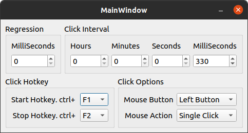

# Mouse Auto Clicker

GUI Mouse Auto Clicker for linux with Python3 and PyQt5

### Installation

```
git clone https://github.com/mrmoein/mouse-auto-clicker.git
cd mouse-auto-clicker
python3 install.py
sudo chmod +x ~/.local/share/applications/mouse-auto-clicker.desktop
```

now search for `Mouse Auto Clicker` app in your desktop launcher.

> ⚠️ IMPORTANT: After the installation please make sure you do not remove the repository. It is required for the desktop shortcut to work.

### screenshots

